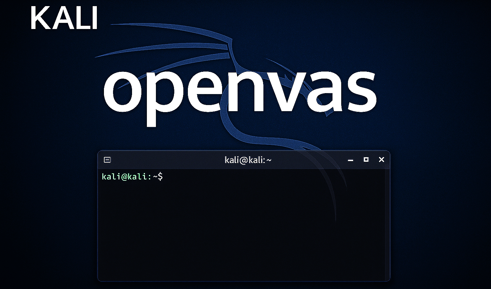
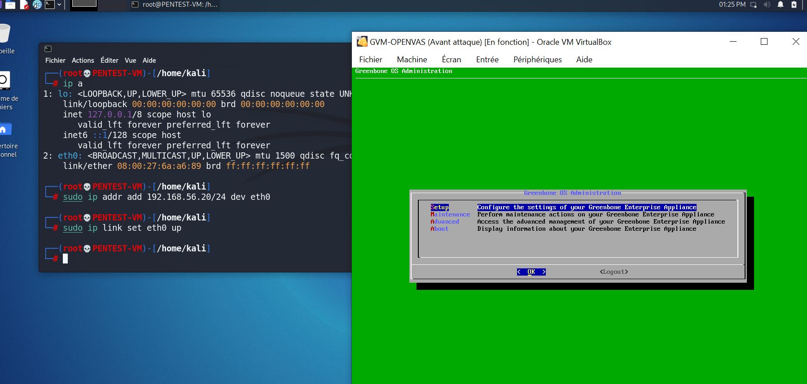
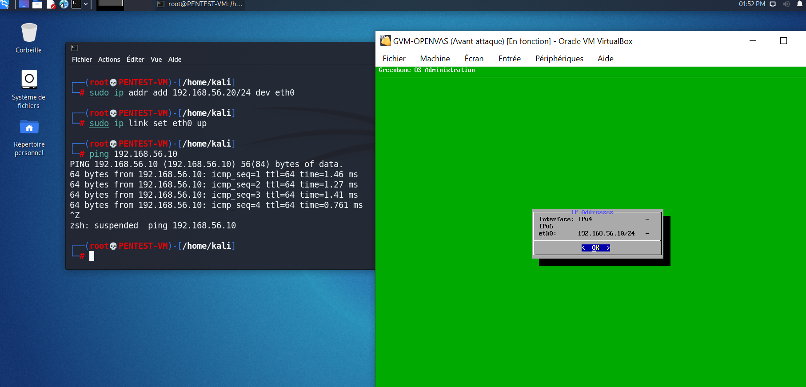
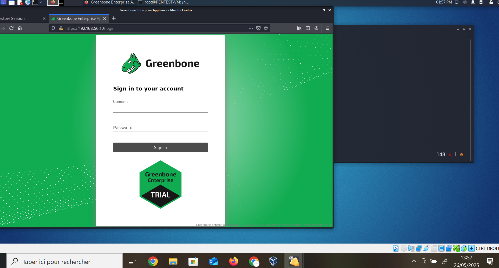
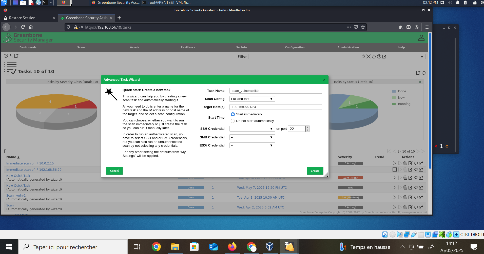
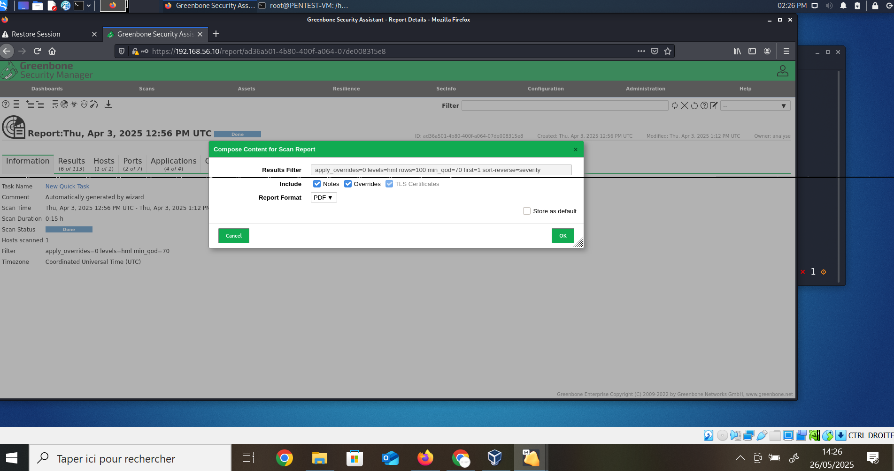

# OpenVAS — Audit de vulnérabilité avec Kali Linux

<p align="center">

</p>

<p align="center"><i>© 2025 <strong>virginie lechene</strong> — Tous droits réservés.<br>
Reproduction interdite sans autorisation.</i></p>

<p align="center">

<a href="https://creativecommons.org/licenses/by-nd/4.0/">

</a>
</p>
<p align="center"><strong>📸 Image protégée — Propriété exclusive</strong></p>

<p align="center">

---

### Licence des visuels

Les visuels de ce dépôt sont protégés par la licence
[**CC BY-ND 4.0**](https://creativecommons.org/licenses/by-nd/4.0/).
Voir le fichier [Licence-visuels.md](./Licence-visuels.md) pour les détails.


## Projet : Analyse de Vulnérabilités avec OpenVAS et Kali Linux

---

## Sommaire
1. [Configuration du Réseau dans VirtualBox](#1-configuration-du-réseau-dans-virtualbox)
2. [Configuration IP statique sur OpenVAS](#2-configuration-ip-statique-sur-openvas)
3. [Vérification de la connectivité](#3-vérification-de-la-connectivité)
4. [Configuration IP statique sur Kali Linux](#4-configuration-ip-statique-sur-kali-linux)
5. [Accès à l’interface web d’OpenVAS](#5-accès-à-linterface-web-dopenvas)
6. [Lancement d’un scan](#6-lancement-dun-scan)
7. [Export d’un Rapport](#7-export-dun-rapport)
8. [Résultat attendu](#8-résultat-attendu)
9. [Auteur](#auteur)

---

## 1. Configuration du Réseau dans VirtualBox

Assurez-vous que les deux machines virtuelles (Kali Linux et OpenVAS) sont connectées au même réseau interne.

**Étapes :**
- Ouvrir les paramètres de chaque VM
- Onglet Réseau
- Sélectionner : `Réseau interne`
- Nom du réseau : `BUREAUTIQUE`

---

## 2. Configuration IP statique sur OpenVAS

**Étapes dans l’interface Greenbone :**

- Aller dans : `Network > Interfaces > eth0`
- Activer `IPv4`
- **Descendre sur `Static IP: [disabled]`**
- Appuyer sur **Entrée** → choisir **enabled**
- Renseigner :`192.168.56.10/24`
- Saisir le DNS :`8.8.8.8`
- Cliquer sur **Save** pour enregistrer la configuration.
  


---

## 3. Vérification de la connectivité

Depuis la VM Kali, ouvrez un terminal :

```bash
ping 192.168.56.10
```

---

## 4. Configuration IP statique sur Kali Linux
Exécutez les commandes suivantes dans le terminal de la VM Kali pour configurer une IP statique :

```bash
sudo ip addr add 192.168.56.20/24 dev eth0
sudo ip link set eth0 up
```



---

## 5. Accès à l’interface web d’OpenVAS

Ouvrez Firefox et accédez à l’interface via l'adresse suivante :

```
https://192.168.56.10
```

Identifiants par défaut :

- **Utilisateur** : admin
- **Mot de passe** : toor



---

## 6. Lancement d’un scan

Pour lancer un scan de vulnérabilités avec OpenVas :

1. Aller dans `Scans > Tasks`
2. Cliquer sur `Wizard`
3. Remplir les champs :
- Nom : `scan_vulnérabilités`
- Cible : `192.168.56.1/24`
- Scan Config : `Full and fast`
- Start time : `Démarrer immédiatement`
4. Cliquer sur `Create`




---

## 7. Export d’un rapport

Pour exporter un rapport :

1. Aller dans `Scans > Reports`
2. Sélectionner un rapport
3. Choisir le format : `PDF`
4. Cliquer sur `OK` pour générer et télécharger



---

## 8. Résultat attendu

- Détection des machines actives
- Classification des vulnérabilités : 
- Hautes
- Moyennes
- Faibles
- Génération d’un rapport lisible et exportable

---

## 9. Avertissement légal

 Ce projet est exclusivement destiné à des fins éducatives, dans le cadre de la formation à la cybersécurité.
 L’auteure ne cautionne ni n’autorise l’utilisation de ces techniques en dehors d’un cadre légal strictement défini.
 Toute utilisation non autorisée est interdite et relève de la seule responsabilité de l’utilisateur.


## 10. Auteur / Droits

© 2025 Virginie Lechene — Tous droits réservés.
Reproduction interdite sans autorisation.


